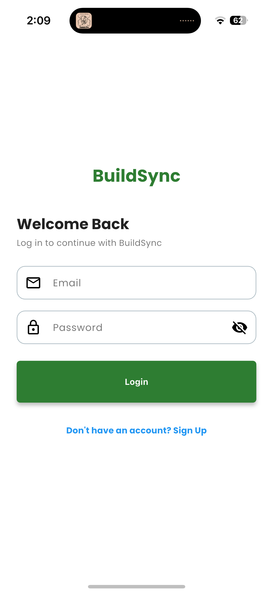
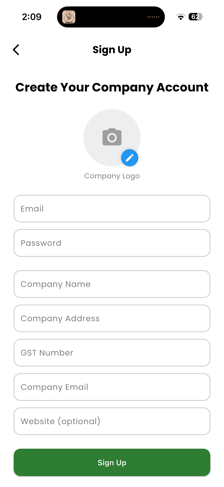
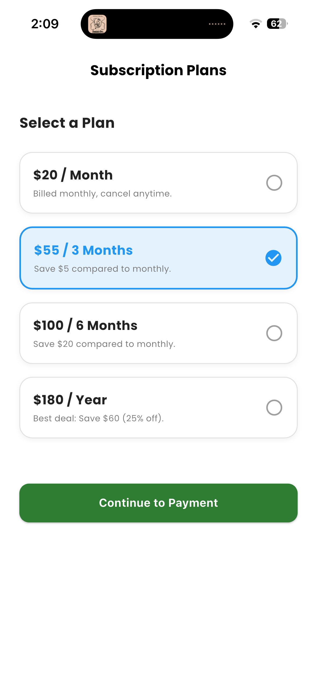
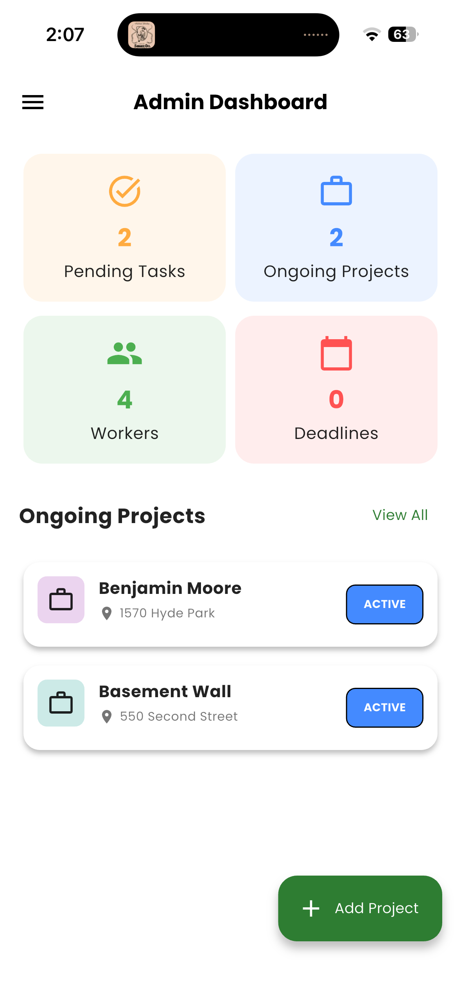
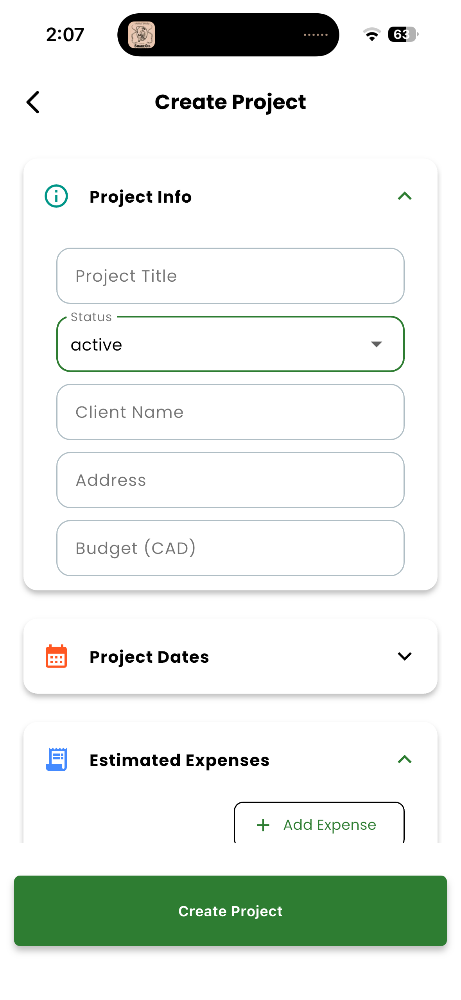
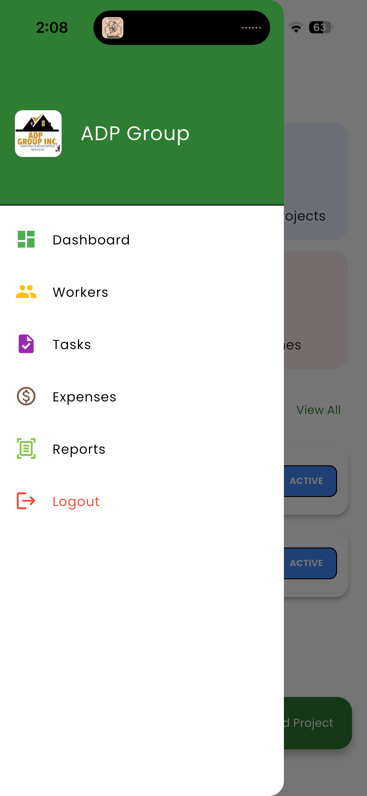
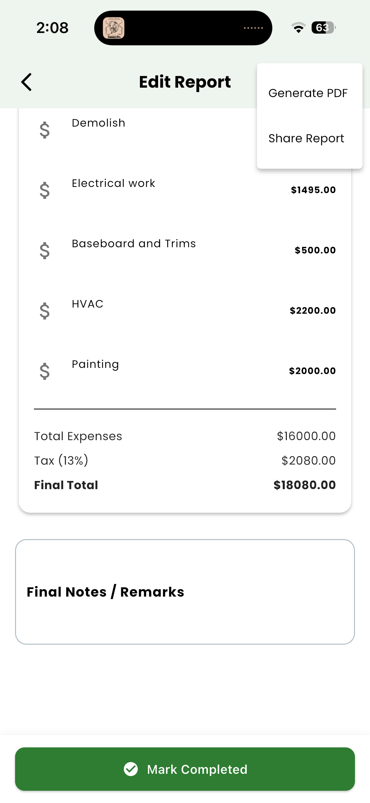
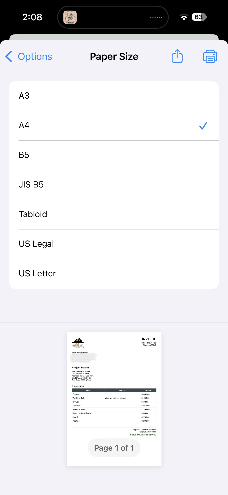
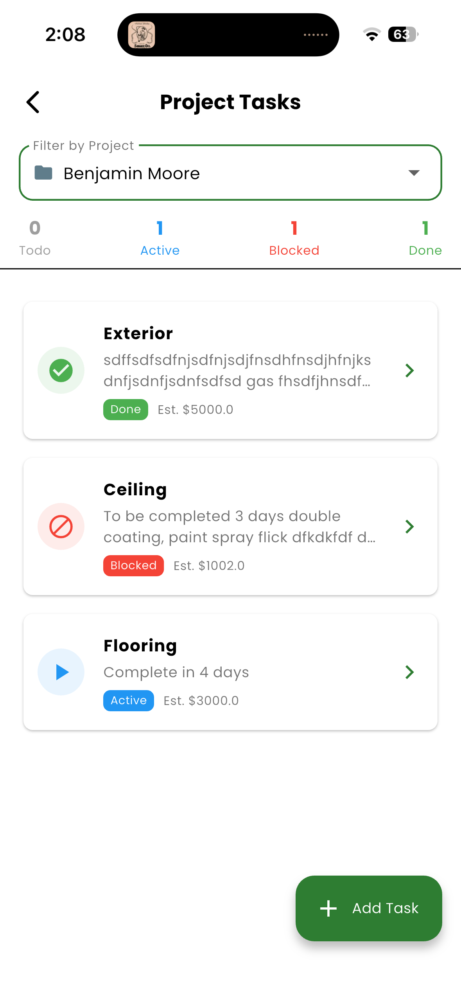
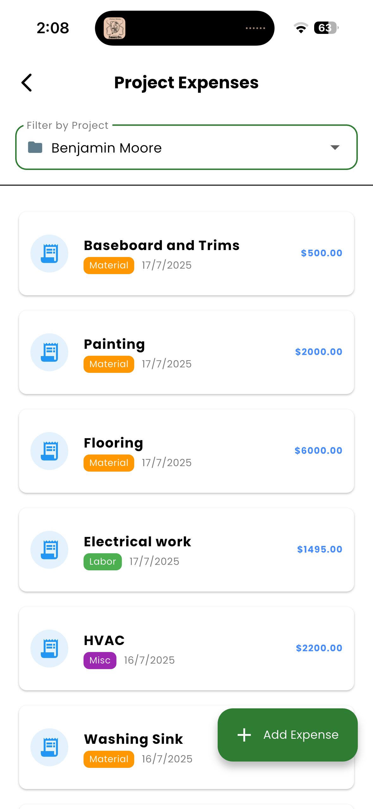

# BuildSync - Project Management App

BuildSync is a Flutter-based **project management app** designed for construction and painting businesses.  
(Currently, the **Admin Dashboard** is ready. Worker app features are coming soon.)

---

## Features (Current)
- Add and manage projects
- Track ongoing tasks
- Generate quotes and invoices (PDF generation)
- Firebase backend with real-time data sync

---

## Screenshots

| Login | Signup | Subscription |
|-------|--------|--------------|
|  |  |  |

| Dashboard | Add Project | Drawer |
|-----------|-------------|--------|
|  |  |  |

| Report | PDF | Tasks |
|--------|-----|-------|
|  |  |  |

| Expenses |  |  |
|----------|----|----|
|  |  |  |

---

## Upcoming
- Worker App (for job assignments and updates)
- Subscription-based SaaS model